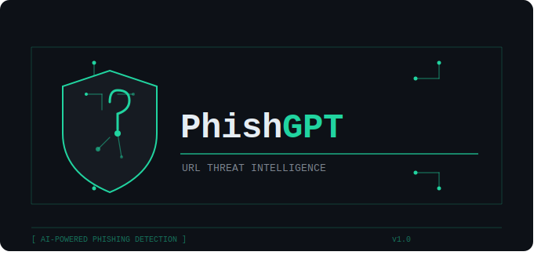
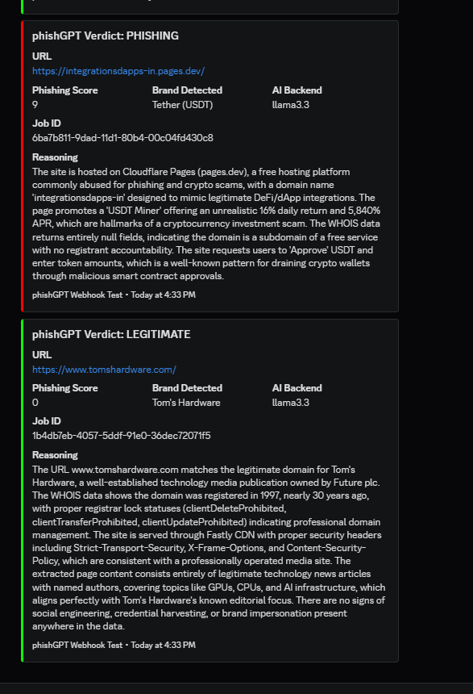

<p align="center">
  
</p>

<p align="center">
  <strong>AI-powered phishing URL detection pipeline</strong><br/>
  Automated URL enumeration, enrichment, and AI-driven verdict delivery
</p>

<p align="center">
  
  
  
  
</p>

---

## Overview

PhishGPT is a containerized pipeline that takes a suspicious URL, runs it through multiple enrichment stages in parallel, assembles the collected intelligence into a structured prompt, and sends it to an AI model for a phishing verdict. The result is a JSON decision with a phishing score, brand identification, and reasoning — delivered to your team via Discord webhook.

The pipeline was designed for security operations teams that handle phishing reports at scale. A URL enters the system (manually, via API, or from a SOAR platform), moves through each enrichment stage automatically, and produces a verdict without analyst intervention. Analysts review the AI output and supporting data rather than performing the enrichment themselves.

### How It Works

When a URL is submitted to the Flask API, a job document is created in MongoDB with a `Pending` status for each pipeline stage. Five independent worker containers poll for jobs matching their stage and execute in a dependency chain:

```
URL Submitted
    │
    ▼
┌──────────────────┐
│  Redirect Check  │  Follow redirects, capture chain + final destination
└────────┬─────────┘
         │
    ┌────┴────┐
    ▼         ▼
┌────────┐ ┌────────────┐
│Net Tools│ │  Site OCR   │  ← Run in parallel after redirect completes
└────┬───┘ └─────┬──────┘
     │           │
     │    ┌──────┘
     │    ▼
     │ ┌────────────┐
     │ │ Screenshot  │  ← Also parallel with net tools + OCR
     │ └─────┬──────┘
     │       │
     ▼       ▼
┌──────────────────┐
│    AI Prompt      │  ← Waits for ALL upstream stages to complete
└────────┬─────────┘
         │
         ▼
┌──────────────────┐
│ Discord Webhook  │  Color-coded verdict embed
└──────────────────┘
```

Each stage writes its results back to the job document and marks itself `Complete`. The AI prompt stage only fires once all four upstream stages are finished, ensuring the model has full context for its analysis.

---

## Enrichment Stages

### Redirect Check

Follows the submitted URL through all HTTP redirects using `requests` with `allow_redirects=True`. Captures the full redirect chain (every intermediate hop with its status code), the final destination URL, response headers, and whether the domain resolved at all. This is critical for phishing analysis because attackers frequently chain through disposable redirect domains.

### Net Tools

Runs domain and IP reconnaissance on the final destination URL. Each enrichment function is independent — if one fails, it stores `null` and the rest continue:

- **Domain extraction** via `tldextract` (handles subdomains correctly)
- **WHOIS lookup** for registration age, registrar, and lock status
- **DNS enumeration** across A, AAAA, CNAME, PTR, NS, MX, and TXT records
- **Geolocation** via IP2Location local database
- **ASN lookup** via Team Cymru for network ownership
- **SSL certificate extraction** including handling of expired/self-signed certs

### Site OCR

Uses `trafilatura` to fetch the page and extract visible text content from the HTML. This captures the actual words the victim would see — login prompts, urgency language, brand references, etc.

### Screenshot

Launches a headless Chrome instance via Selenium, captures a full-page screenshot as base64, and runs Tesseract OCR on the image. This catches text rendered by JavaScript that `trafilatura` might miss, and preserves a visual record of what the page looked like at analysis time.

---

## AI Analysis

### Prompt Construction

Once all enrichment stages complete, the AI prompt worker assembles their outputs into a single structured prompt. The prompt provides the model with:

- The starting URL and final destination URL (to see if a redirect occurred)
- Extracted page text from both `trafilatura` and screenshot OCR
- Full net tools enrichment data (WHOIS, DNS, geolocation, ASN, certificate info)
- Response headers from the final destination

The model is instructed to act as a security expert and analyze this data for social engineering techniques, brand impersonation, suspicious domain patterns, and other phishing indicators.

### Decision Schema

The AI returns a JSON object with this schema:

```json
{
    "phishing_score": 9,
    "brands": "Tether (USDT)",
    "phishing": true,
    "suspicious_domain": true,
    "reasoning": "4-5 sentence explanation of the verdict..."
}
```

| Field | Type | Description |
|---|---|---|
| `phishing_score` | int (0-10) | Risk score — 0 is safe, 10 is almost certainly phishing |
| `brands` | string or null | Identified brand being impersonated, if any |
| `phishing` | boolean | Final verdict |
| `suspicious_domain` | boolean | Whether the domain itself looks illegitimate |
| `reasoning` | string | 4-5 sentence explanation of the analysis |

### Backend Configuration

PhishGPT supports two AI backends, switchable via environment variable or per-job:

| Backend | Use Case | Config |
|---|---|---|
| **Ollama** (default) | Local LLM on your homelab, no API costs | `AI_BACKEND=ollama` |
| **Claude API** | Higher accuracy for critical URLs | `AI_BACKEND=claude` |

Per-job override: submit a URL with `"model": "claude-sonnet-4-20250514"` and it routes to Claude for that job regardless of the global setting. Any other model value routes to Ollama.

---

## Discord Notifications

Verdicts are delivered as color-coded embeds to a Discord webhook — red for phishing, green for legitimate, yellow for unknown. Each embed includes the URL, phishing score, detected brand, AI backend used, job ID, and the model's reasoning.

<p align="center">
  
</p>

---

## Project Structure

```
phishGPT/
├── Dockerfile                  # Multi-stage build (all services)
├── docker-compose.yml          # Service orchestration
├── .env                        # Your local config (from .env.example)
├── .env.example                # Template with all options documented
│
├── app.py                      # Flask API (queue manager)
├── init-mongo.js               # MongoDB init (schema + indexes)
│
├── scripts/
│   ├── redirect_check.py       # Redirect detection worker
│   ├── net_tools.py            # DNS/WHOIS/ASN/geo/cert worker
│   ├── site_ocr.py             # Trafilatura text extraction worker
│   ├── screenshot.py           # Headless Chrome + Tesseract worker
│   └── ai_prompt.py            # Claude / Ollama analysis worker
│
├── requirements/
│   ├── base.txt                # Shared deps (dotenv, requests, pymongo)
│   ├── flask_app.txt           # Flask, gunicorn, validators
│   ├── net_tools.txt           # whois, dns, IP2Location, cymru, tld
│   ├── ocr.txt                 # trafilatura
│   ├── screenshot.txt          # selenium, pillow, pytesseract
│   └── ai_prompt.txt           # anthropic
│
├── data/
│   └── IP2LOCATION-LITE-DB11.BIN
│
└── images/
    ├── phishgpt_logo.svg
    └── sample_results.png
```

---

## Quick Start

```bash
# 1. Clone and configure
cp .env.example .env
# Edit .env with your MongoDB, Ollama, and Discord webhook settings

# 2. Build and launch
docker compose up -d --build

# 3. Submit a URL for analysis
curl -X POST http://localhost:5000/update \
  -H "Content-Type: application/json" \
  -d '{
    "data": "https://suspicious-site.example.com",
    "tag": "phishgpt",
    "priority": 1,
    "model": "llama3.3"
  }'

# 4. Check queue status
curl http://localhost:5000/list
```

---

## Environment Variables

| Variable | Default | Description |
|---|---|---|
| `DB_URL` | `mongodb://localhost:27017` | MongoDB connection string |
| `DB_NAME` | `gpt_app` | Database name |
| `DB_COLLECTION` | `gpt_app` | Collection name |
| `BASE_APP` | `http://localhost:5000` | Flask API URL |
| `POLL_INTERVAL` | `4` | Worker polling interval in seconds |
| `AI_BACKEND` | `ollama` | Default AI backend (`ollama` or `claude`) |
| `OLLAMA_HOST` | `http://localhost:11434` | Ollama server URL |
| `OLLAMA_MODEL` | `llama3.3` | Default Ollama model |
| `ANTHROPIC_API_KEY` | — | Claude API key (required for claude backend) |
| `CLAUDE_MODEL` | `claude-sonnet-4-20250514` | Claude model identifier |
| `IP2LOC_DB_PATH` | `/opt/data/IP2LOCATION-LITE-DB11.BIN` | Path to IP2Location database |
| `DISCORD_WEBHOOK_URL` | — | Discord webhook for verdict notifications |
| `PAGE_LOAD_WAIT` | `3` | Seconds to wait for page render in screenshot |
| `REDIRECT_TIMEOUT` | `10` | HTTP timeout for redirect checks |

---

## API Endpoints

| Method | Endpoint | Description |
|---|---|---|
| `POST` | `/update` | Submit a URL for analysis |
| `GET` | `/list` | List all jobs in the queue |
| `GET` | `/health` | Health check |
| `GET` | `/queue/<stage>` | Pull next job for a pipeline stage |
| `GET` | `/redirect_queue` | Alias for `/queue/redirect_queue` |
| `GET` | `/net_tools_queue` | Alias for `/queue/net_tools_queue` |
| `GET` | `/screenshot_queue` | Alias for `/queue/screenshot_queue` |
| `GET` | `/ocr_queue` | Alias for `/queue/ocr_queue` |
| `GET` | `/phishGPT_queue` | Alias for `/queue/phishGPT_queue` |

### Submit URL Payload

```json
{
  "data": "https://suspicious-url.example.com",
  "tag": "phishgpt",
  "priority": 1,
  "model": "llama3.3",
  "CaseID": "optional-soar-case-id"
}
```

---

## Accessing Ollama from Docker

If Ollama runs on the Docker host (not in a container):

```bash
OLLAMA_HOST=http://host.docker.internal:11434
```

If Ollama runs in its own container on the same compose network:

```bash
OLLAMA_HOST=http://ollama:11434
```

---

## License

This project is provided as-is for security research and internal use.